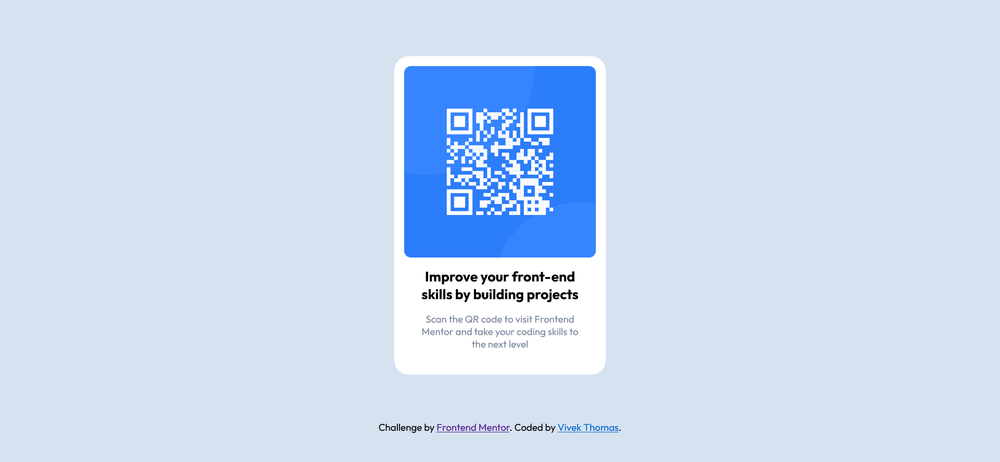

# Frontend Mentor - QR code component solution

This is a solution to the [QR code component challenge on Frontend Mentor](https://www.frontendmentor.io/challenges/qr-code-component-iux_sIO_H). Frontend Mentor challenges help you improve your coding skills by building realistic projects. 

## Table of contents

- [Overview](#overview)
  - [Screenshot](#screenshot)
  - [Links](#links)
- [My process](#my-process)
  - [Built with](#built-with)
  - [What I learned](#what-i-learned)
- [Author](#author)
- [Acknowledgments](#acknowledgments)


## Overview

### Screenshot

 


### Links

- Solution URL: [https://vithe-qr-code.netlify.app/](https://vithe-qr-code.netlify.app/)
- Live Site URL: [Add live site URL here](https://your-live-site-url.com)

## My process

### Built with

- Semantic HTML5 markup
- CSS custom properties
- Flexbox
- CSS Grid
- Mobile-first workflow


### What I learned

Learnt to fix image to it's original ratio while fitting it's
parent element

```css
  picture,img {
  max-width: 100%;
  object-fit: contain;
}
```
### Useful resources

- [Kevin Powell](https://www.youtube.com/channel/UCJZv4d5rbIKd4QHMPkcABCw)
- [WebDevSimplified](https://www.youtube.com/channel/UCFbNIlppjAuEX4znoulh0Cw)

## Author

- Website - [Vivek Thomas](https://github.com/VThomas241)
- Frontend Mentor - [@VThomas241](https://www.frontendmentor.io/profile/yourusername)